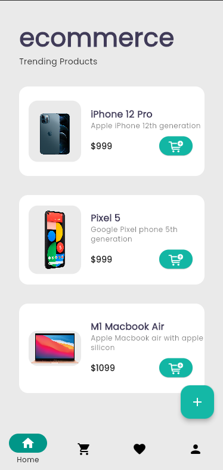
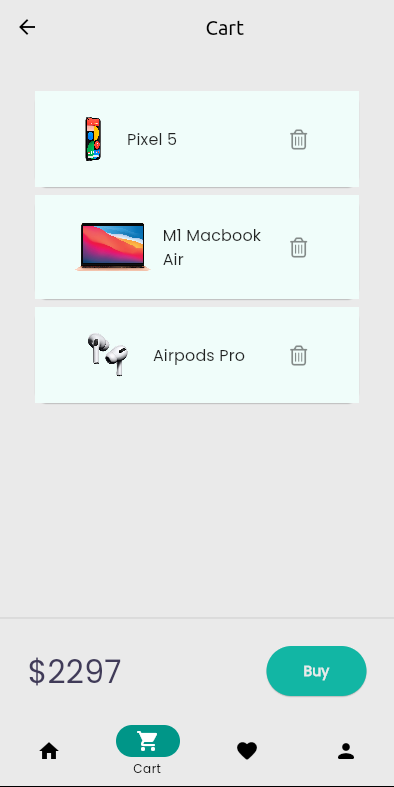
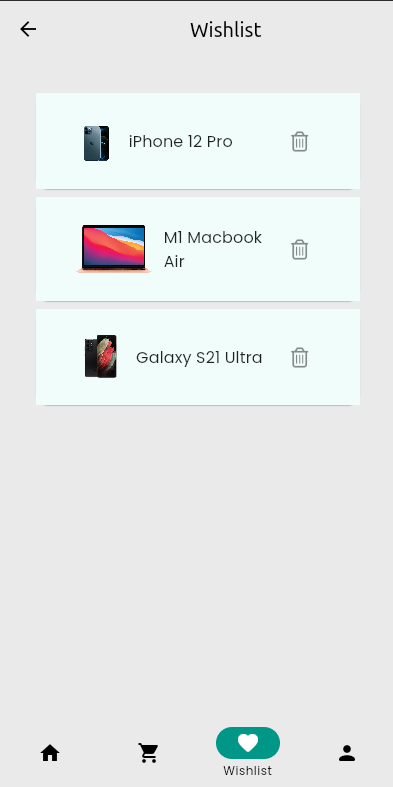
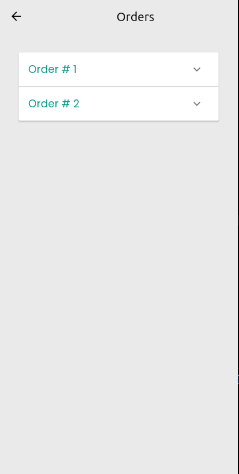

# ecommerceflutter

A Flutter project.

<table class="wp-table">
    <tr>
      <td>
      
      </td>
      <td>
      
      </td>
      <td>
      
      </td>
    </tr>
    <tr>
      <td>Login Page</td>
      <td>Register Page</td>
      <td>Home Page</td>
    </tr>
     <tr>
      <td>
      
      </td>
      <td>
      
      </td>
      <td>
      
      </td>
    </tr>
    <tr>
      <td>Cart Page</td>
      <td>Wishlist Page</td>
      <td>Profile Page</td>
    </tr>
    <tr>
      <td>
      
      </td>
      <td>
      
      </td>
    </tr>
    <tr>
      <td>Orders Page</td>
      <td>Order Success Page</td>
    </tr>
  </table>
